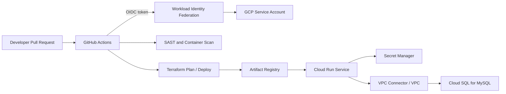

# FoxGuard Security Portal - Technical Architecture

## System Overview
The FoxGuard Security Portal is an automated, cloud-native incident management platform designed with strict isolation barriers, minimum privilege access controls, and a fully containerized deployment pipeline. 

## Component Breakdown
* **Frontend/Backend Routing Engine:** Built on Python 3.11 using the Flask framework. Handles user authorization loops and ticket creation dashboards.
* **Database Infrastructure:** Powered by a fully managed Google Cloud SQL for MySQL instance. The database is reached by the application through private, controlled configuration rather than a database container.
* **Serverless Compute Layer:** Google Cloud Run dynamically scales the stateless Docker containers based on incoming HTTPS traffic, minimizing running costs and exposure footprints.
* **Secret Management Hub:** Sensitive credentials, database string keys, and authentication tokens are kept strictly inside GCP Secret Manager and injected at runtime rather than hardcoded into source control.
* **Artifact Storage:** Docker images are built and stored in Google Artifact Registry before Cloud Run deployment.
* **Network Boundary:** A Google Cloud VPC provides the private network boundary for application-to-database connectivity.

## Secure Identity Flow
Authentication between GitHub Actions pipelines and Google Cloud Platform utilizes OpenID Connect (OIDC) Workload Identity Federation. This eliminates long-lived, static IAM keys and instead requests transient, short-lived tokens to apply configurations safely.

## Architecture Diagram

## Required Components
* **Cloud Run:** Hosts the containerized Flask application.
* **Cloud SQL:** Stores `users` and `tickets` in a managed MySQL database.
* **VPC:** Provides the private network path between Cloud Run and Cloud SQL.
* **Secret Manager:** Stores database password and runtime secrets.
* **Artifact Registry:** Stores the FoxGuard Docker image.
* **OIDC:** Allows GitHub Actions to authenticate to GCP without static JSON keys.
